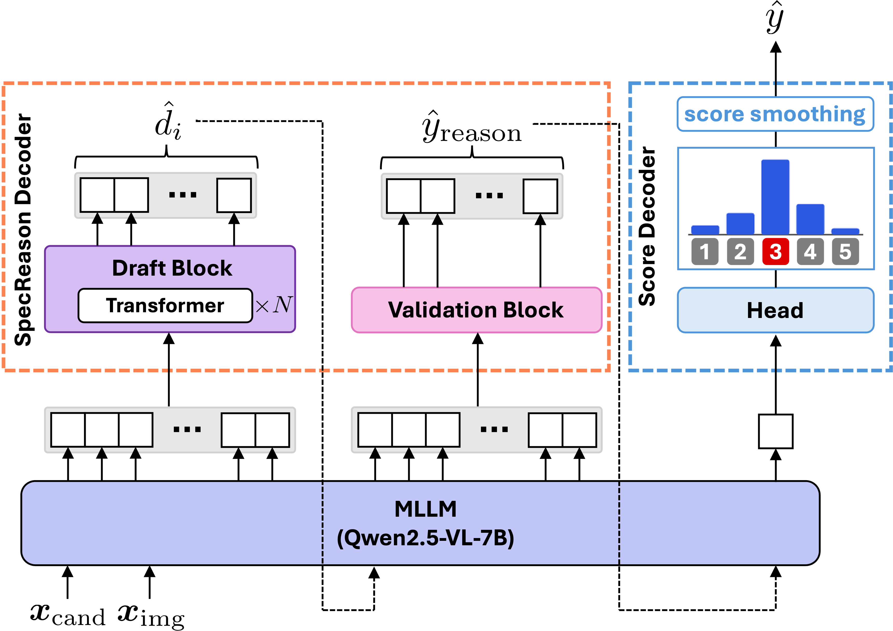

# Kaus: Fast Image Captioning Evaluation via Speculative Decoding

Kaus is a reference-free image captioning metric built on a **Bi-EXPERT** framework.
It combines a **SpecReason Decoder** (speculative decoding for fast reasoning generation) with a **Score Decoder** (ExtendedScoreHead) to produce accurate evaluation scores with significantly reduced inference time.

<p align="center">
  
</p>

## Method

Given an image and a candidate caption, Kaus runs a 2-turn pipeline:

1. **Turn 1 — Reasoning** (SpecReason Decoder): A draft transformer generates reasoning tokens speculatively; the base model validates them in parallel.
2. **Turn 2 — Scoring** (ExtendedScoreHead): A 1-layer linear head projects the final hidden state to 13 virtual digit classes K = {−0.1, 0.0, 0.1, …, 1.0, 1.1}. The final score is ŷ = Σ k·p_k, clipped to [0, 1].

## Ascella Dataset

The `ascella_dataset/` directory contains the training data used to train Kaus.
`Polaris-exp` and `Nebula-exp` are extended versions of [Polaris](https://huggingface.co/datasets/yuwd/Polaris) and [Nebula](https://huggingface.co/datasets/Ka2ukiMatsuda/Nebula), with reasoning texts added to each image–caption pair.

| File | Split | Samples |
|---|---|---|
| `ascella_dataset/polaris.json` | Polaris-exp | 11,777 |
| `ascella_dataset/nebula.json`  | Nebula-exp  | 23,251 |

Each entry contains:

```json
{
  "image_id":      "...",
  "caption":       "...",
  "score":         0.6875,
  "gpt_reasoning": "GPT-4o generated reasoning text",
  "qwen_reasoning": "Qwen2.5-VL rewritten reasoning text (used by Kaus)"
}
```

## Environment Setup

```bash
pip install uv
uv sync
```

Kaus requires Python ≥ 3.10 and a CUDA-capable GPU (tested on A100 80GB).

## Quick Start

```bash
python example.py \
    --base-model-path  Qwen/Qwen2.5-VL-7B-Instruct \
    --spec-model-path  JLKang/ViSpec-Qwen2.5-VL-7B-Instruct \
    --score-head-path  <path/to/score_head.pt>
```

This runs Kaus on 5 sample (image, caption) pairs in `data/sample/` and prints the predicted score alongside the human gold score.

## Evaluation

### Kaus (speculative decoding)

```bash
bash evaluate/run_eval_kaus.sh \
    <base-model-path> \
    <spec-model-path> \
    <score-head-path> \
    <dataset>   # nebula | flickr8k-ex | flickr8k-cf | composite
```

### Baseline (autoregressive)

```bash
bash evaluate/run_eval_baseline.sh \
    <base-model-path> \
    <score-head-path> \
    <dataset>
```

Results are saved under `results/`.

### Download Images

Evaluation on full benchmarks requires downloading images:

- **Flickr8k**: [Kaggle](https://www.kaggle.com/datasets/adityajn105/flickr8k) → place under `datasets/flickr8k/Images/`
- **Flickr30k**: [Kaggle](https://www.kaggle.com/datasets/hsankesara/flickr-image-dataset) → `datasets/flickr30k/images/`
- **COCO val2014**: `wget http://images.cocodataset.org/zips/val2014.zip` → `datasets/coco/val2014/`
- **Polaris**: [Polos repository](https://github.com/keio-smilab24/Polos) → `datasets/polaris/polaris/`
- **Nebula**: loaded automatically from [HuggingFace](https://huggingface.co/datasets/Ka2ukiMatsuda/Nebula)

## Training

Training proceeds in three steps. Set `BASE_MODEL`, `SPEC_MODEL`, and checkpoint paths in each script before running.

### Step 1 — Pretrain Score Head

Trains the ExtendedScoreHead with the backbone and SpecReason Decoder frozen.

```bash
bash train/run_train_score_head.sh
```

### Step 2 — Finetune Backbone (LoRA)

Trains the Qwen2.5-VL backbone with LoRA, then merges the adapter.

```bash
bash train/run_finetune_backbone.sh
python train/merge_lora.py --model-path <lora-ckpt> --output-path <merged-ckpt>
```

### Step 3 — Finetune Score Head (Limited MAE)

Fine-tunes the Score Head with a limited MAE loss to refine score calibration.

```bash
bash train/run_finetune_score_head.sh
```

### Draft Model Training (optional)

To train the draft transformer from scratch:

```bash
bash train/run_gen_draft_data.sh   # generate hidden-state data
bash train/run_train_draft.sh
```

## Citation

```bibtex
@inproceedings{noguchi2026kaus,
  title     = {Fast Automatic Evaluation Metric for Image Captioning Based on Speculative Decoding},
  author    = {Noguchi, Takumi and Wada, Yuiga and Koyama, Shuitsu and Sugiura, Komei},
  booktitle = {Proceedings of MIRU 2026},
  year      = {2026},
}
```
